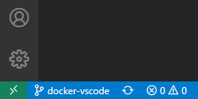
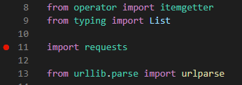

.. meta::
   :description: The Contribution Guide includes information on what you should follow to contribute to the SDK package.

# Contribution Guide

If you would like to contribute, please use the development installation and open a PR with your contributions.

* clone the project in your working directory

  `git clone https://github.com/konfuzio-ai/document-ai-python-sdk.git`

* go inside the project folder

  `cd document-ai-python-sdk`

* install it

  `pip install -e .[dev]`

* use pre-commit

  `pre-commit install`

  Automatic inspections will run in your commits ensuring they match the code formatting of the repository.

* commit your changes

  `git commit -m "message"`

* push your changes to your remote branch

  `git push`

* open a PR with your contributions. You can do it on the
[GitHub interface](https://docs.github.com/en/github/collaborating-with-pull-requests/proposing-changes-to-your-work-with-pull-requests/creating-a-pull-request).

Tests will automatically run for every commit you push to the GitHub project.
You can also run them locally by executing `pytest` in your terminal from the root of this project.

The files/folders listed below are ignored when you push your changes to the repository.
- .env file
- .settings.py file
- data folder
- konfuzio_sdk.egg-info folder
- IDE settings files
- docs/build/ folder
- *.pyc files

*Note*:
If you choose another name for the folder where you want to store the data being downloaded, please add
the folder to *.gitignore*.

## Directory Structure

```
├── document-ai-python-sdk      <- SDK project name
│   │
│   ├── docs                    <- Documentation to use konfuzio_sdk package in a project
│   │
│   ├── konfuzio_sdk            <- Source code of Konfuzio SDK
│   │  ├── __init__.py          <- Makes konfuzio_sdk a Python module
│   │  ├── api.py               <- Functions to interact with the Konfuzio Server
│   │  ├── cli.py               <- Command Line interface to the konfuzio_sdk package
│   │  ├── data.py              <- Functions to handle data from the API
│   │  ├── settings_importer.py <- Meta settings loaded from the project
│   │  ├── urls.py              <- Endpoints of the Konfuzio host
│   │  └── utils.py             <- Utils functions for the konfuzio_sdk package
│   │
│   ├── tests                   <- Pytests: basic tests to test scripts based on a demo project
│   │
│   ├── .gitignore              <- Specify files untracked and ignored by git
│   ├── README.md               <- Readme to get to know konfuzio_sdk package
│   ├── pytest.ini              <- Configurations for pytests
│   ├── settings.py             <- Settings of SDK project
│   ├── setup.cfg               <- Setup configurations
│   ├── setup.py                <- Installation requirements

```

## Running tests locally

Some tests do not require access to the Konfuzio Server. Those are marked as "local".

To run all tests, do:

`pytest`

To run only local tests, do:

`pytest -m 'local'`

To run tests from a specific file, do:

`pytest tests/<name_of_the_file>.py`


## Running tests in Docker

If you have problems with the dependencies, a solution could be to use a docker to run the code.
Check here the steps for how to run/debug Python code inside a Docker container.

### General Motivation for using the VS Code Remote Development Extension

When it comes to running your code consistently and reliably, container solutions like Docker can play to their strengths.
Even if you are not using Docker for deployment, as soon as you collaborate with other developers testing pipelines
have to be in place to ensure that a new merge does not accidentally break the whole project.
Collaborating can also mean very different operating systems and configurations that lead to varying behaviors on different machines.
This issue is also commonly resolved using Docker. But this of course means that there can be differences between your local machine
and the Docker container when it comes to dependencies, which leads to tedious dependency management and prolonged feedback loops (especially on Windows)
as you have to wait to see if the code you build really runs as expected in the Docker container.
The best solution would be if you could combine the development tools of a Python IDE with the consistent test and execution results of a Docker container.
Running a docker container on a local machine is quite easy.
Though setting up your container for debugging is not always straightforward. Luckily Microsoft's Visual Studio Code Remote Development Extension
offers a functional and easy to use solution.

### 1. Download and Install VS Code on your machine

Either use this [link](https://code.visualstudio.com/download) to download the VS Code or, if you are on Linux and have
snap installed, just run (for this tutorial v1.56.2 was used):

```python
sudo snap install --classic code
```
If you have not already installed Docker, download and install it [here](https://docs.docker.com/get-docker/).

### 2. Pull/Create your project that includes the relevant Docker file

In most cases you are going to be using git, so just set up a new git-repository via the terminal, VS Code’s built-in
console or VS Code’s git extension. This project should, of course, include the Docker file that is used for deployment
and which behavior you want to mimic locally.

If you just want to try out how this all works, you can clone our SDK from its
[GitHub page](https://github.com/konfuzio-ai/document-ai-python-sdk.git) and add a Dockerfile with the following
content:

```dockerfile
# simple docker file
FROM python:3.8-slim

ADD setup.py /code/setup.py
ADD konfuzio_sdk /code/konfuzio_sdk
ADD README.md /code/README.md

WORKDIR /code/

RUN python3.8 -m venv /opt/venv
ENV PATH="/opt/venv/bin:$PATH" VIRTUAL_ENV="/opt/venv"

RUN pip install -e .
RUN pip install pytest
```

### 3. Install the remote development extension

In VS Code open the extensions tab (its icon is located in the left sidebar) and search **Remote - Containers** (or for
its ID: *ms-vscode-remote.remote-containers*). Install the extension.

<!--[extensions tab](images/vscode_docker/extensions.PNG)-->


### 4. Set up your remote development environment

You should now be able to find the remote extension's symbol (arrows on a green background) in the bottom left corner of
the VS Code window (picture below). Clicking on the symbol opens the extension's command pallet, which from now on is
going to be our main access point to the extension.



In the Command Pallet (*'View' > 'Command Pallet'*) select *'Remote-Containers: Add Development Container Configuration
Files' > 'From $your_dockerfile'*


Now you should see in the file explorer under *.devcontainer* your *devcontainer.json* file. Open it. These are the basic
configurations of your devcontainer. Most of this can be left unchanged. Maybe give your container a name by changing
the 'name' variable. Additionally, you should specify all the ports you need inside your Docker container in
'forwardPorts'.
If you are working with the sample project you do not need to specify any ports.


### 5. Build and run your Docker container

Open the extension’s command pallet by clicking on the arrows in the bottom left and search
for *‘Reopen Folder in Container’*. If you are doing this the first time, this builds the Docker container and thus
can take quite a bit of time.

To confirm that you are now inside the container look again to the bottom left. You should now be able to
see *'Dev Container: $your_name'* next to the two arrows.


### 6. Install the Python extension inside the Docker container to debug and run Python files

Again open up the extensions tab (now inside the Docker container) and install the Python extension (ID: *ms-python.python*).

Now you can debug/run any Python file you want. Open up the chosen Python file and the 'Run and Debug' tab by clicking
the run/debug icon that should be now available on the left taskbar.

<!--[run and debug tab](images/vscode_docker/run_and_debug.PNG)-->

Click *‘Run and Debug’ > ‘Python File’* and you are good to go. Before make sure to set the needed breakpoints by
clicking to the left of the line numbers.



If you want to evaluate certain expressions while debugging, open up the terminal (if it is not open already) by
clicking *‘View’ > ‘Terminal’*. One of the terminal's tabs is the debug console, where you can evaluate any expression.

If you are in the sample project you can make sure that the Docker container works as expected by entering the tests
folder (*'cd tests'*) and executing:

```python
pytest -m local
```


### Additional Tips

- If you want to switch back to your local machine (to e.g. switch branch), open the extension’s command pallet by
  clicking on the arrows and select *‘Reopen Folder Locally’*.

- If you want to rebuild the container, because e.g. a different branch uses different dependencies, open the
  extension’s command palette and click *'Rebuild Container'*.
(This of course means that you have to reinstall the Python extension - if this becomes annoying you can specify
  its ID in the devcontainer.json file to be pre-installed with every rebuild).
