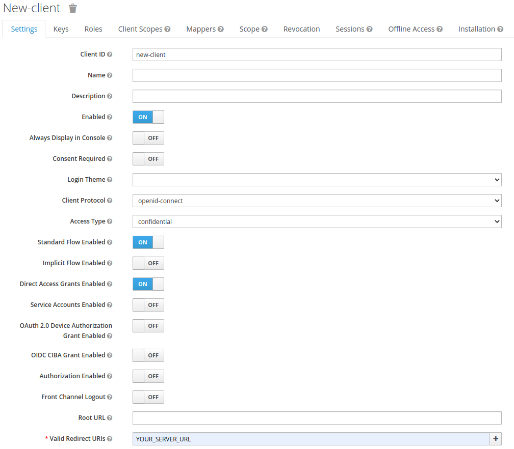
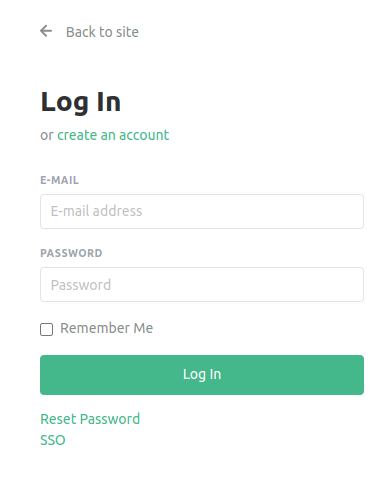
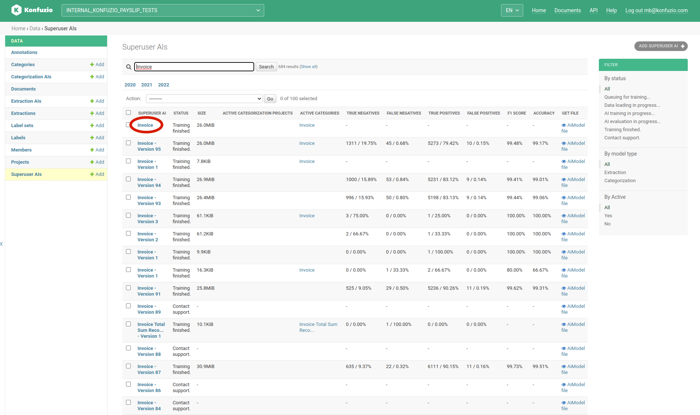
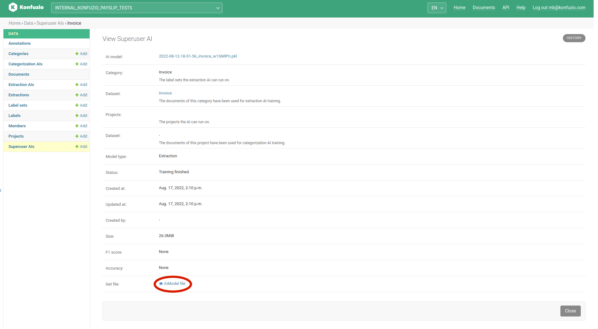
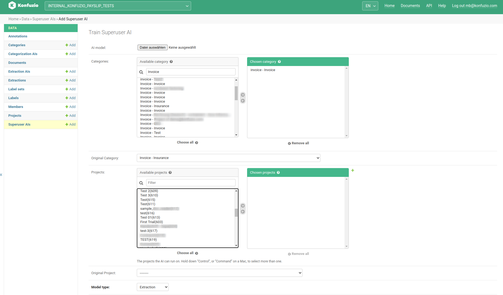
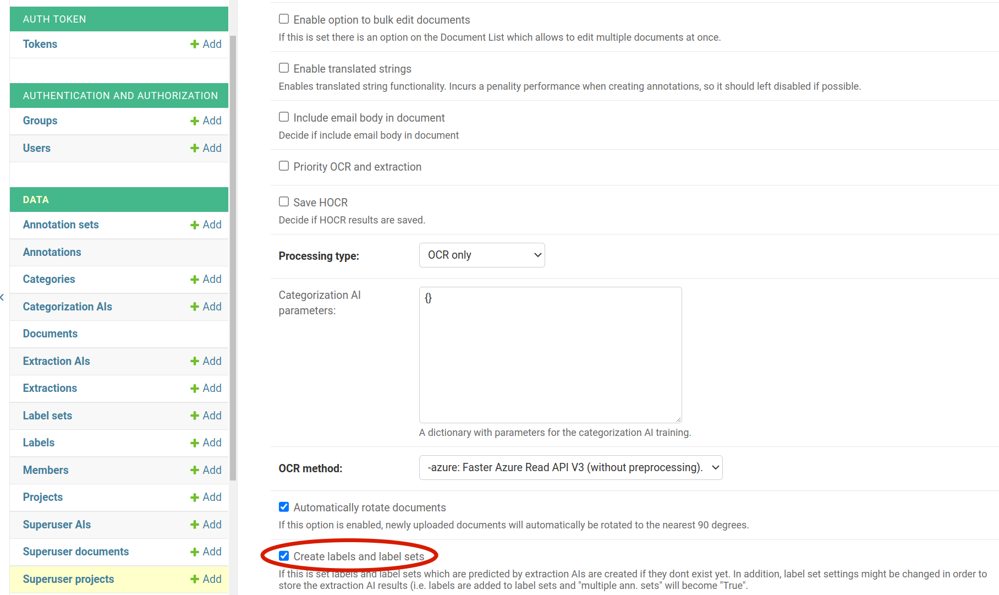

.. meta::
   :description: Documentation on how to deploy Konfuzio on premises using Kubernetes and Helm.

.. _Server Installation:

# On-Premises Documentation

On-premises, also known as self-hosted, is a setup that allows Konfuzio to be implemented 100% on your own infrastructure. In practice, it means that you know where your data is stored, how it's handled and who gets hold of it. This is because you keep the data on your own servers.

A common way to operate a production-ready and scalabe Konfuzio installation is via Kubernetes. An alternative and more light-weight deployment option is the [Single VM setup via Docker](/web/on_premises.html#alternative-deployment-options). We recommend to use the option which is more familiar to you.

On-Premise Konfuzio installations allow to create Superuser accounts which can access all [Documents](https://help.konfuzio.com/modules/superuserdocuments/index.html), [Projects](https://help.konfuzio.com/modules/superuserprojects/index.html) and [AIs](https://help.konfuzio.com/modules/superuserais/index.html) via a dedicated view as well as creating custom [Roles](https://help.konfuzio.com/modules/superuserroles/index.html)

## Kubernetes

### Required tools

Before deploying Konfuzio to your Kubernetes cluster, there are some tools you must have installed locally.

#### kubectl

kubectl is the tool that talks to the Kubernetes API. kubectl 1.15 or higher is required and it needs to be compatible 
with your cluster ([+/-1 minor release from your cluster](https://kubernetes.io/docs/tasks/tools/#before-you-begin)).

[> Install kubectl locally by following the Kubernetes documentation](https://kubernetes.io/docs/tasks/tools/#install-kubectl).

The server version of kubectl cannot be obtained until we connect to a cluster. Proceed
with setting up Helm.

#### Helm

Helm is the package manager for Kubernetes. Konfuzio is tested and supported with Helm v3.

##### Getting Helm

You can get Helm from the project's [releases page](https://github.com/helm/helm/releases), or follow other options 
under the official documentation of [installing Helm](https://helm.sh/docs/intro/install/).

###### Connect to a local Minikube cluster

For test purposes you can use `minikube` as your local cluster. If `kubectl cluster-info`
is not showing `minikube` as the current cluster, use `kubectl config set-cluster
minikube` to set the active cluster. For clusters in production please visit the [Kubernetes
Documentation](https://kubernetes.io/docs/setup/production-environment/).

##### Initializing Helm

If Helm v3 is being used, there no longer is an `init` sub command and the command is
ready to be used once it is installed. Otherwise please upgrade Helm.

#### Next steps

Once kubectl and Helm are configured, you can continue to configuring your Kubernetes
cluster.

### Deployment

Before running `helm install`, you need to make some decisions about how you will run
Konfuzio. Options can be specified using Helm's `--set option.name=value` or `--values=my_values.yaml` command
line option. A complete list of command line options can be found [here](https://helm.sh/docs/helm/). This guide will
cover required values and common options.

Create a values.yaml file for your Konfuzio configuration. See Helm docs for information on how your values file will override the defaults.
Useful default values can be found in the [values.yaml](https://git.konfuzio.com/shared/charts/-/blob/master/values.yaml) in the chart [repository](https://git.konfuzio.com/shared/charts).

#### Selecting configuration options

In each section collect the options that will be combined to use with `helm install`.

##### Secrets

There are some secrets that need to be created (e.g. SSH keys). By default they will be
generated automatically.

##### Networking and DNS

By default, Konfuzio relies on Kubernetes `Service` objects of `type: LoadBalancer` to
expose Konfuzio services using name-based virtual servers configured with `Ingress`
objects. You'll need to specify a domain which will contain records to resolve the
domain to the appropriate IP.

`--set ingress.enabled=True`  
`--set ingress.HOST_NAME=konfuzio.example.com`  

<!-- 
###### IPs

If you plan to use an automatic DNS registration service,you won't need any additional
configuration for Konfuzio, but you will need to deploy it to your cluster.

If you plan to manually configure your DNS records they should all point to a static IP.
For example if you choose `example.com` and you have a static IP of `10.10.10.10`, then
`konfuzio.example.com`, `registry.example.com` and `minio.example.com` (if using MinIO) should all resolve to
`10.10.10.10`.

_Include these options in your Helm install command:_

`--set global.hosts.externalIP=10.10.10.`
-->

##### Persistence

By default the setup will create Volume Claims with the expectation that a dynamic
provisioner will create the underlying Persistent Volumes. If you would like to customize
the storageClass or manually create and assign volumes,please review the [storage
documentation](https://kubernetes.io/docs/concepts/storage/volumes/).

**Important** : After initial installation, making changes to your storage settings requires manually editing Kubernetes
objects, so it's best to plan ahead before installing your production instance of Konfuzio to avoid extra storage
migration work.

##### TLS certificates

You should be running Konfuzio using https which requiresTLS certificates. By default, the setup will install and 
configure [cert-manager](https://github.com/jetstack/cert-manager) to obtain free TLS certificates. If you
have your own wildcard certificate, you already have cert-manager installed, or you have
some other way of obtaining TLS certificates. For the default configuration, you must
specify an email address to register your TLS certificates.

_Include these options in your Helm install command:_

`--set certmanager-issuer.email=me@example.com`

##### PostgreSQL

By default this Konfuzio provides an in-cluster PostgreSQL database, for trial purposes
only.

**NOTE: This configuration is not recommended for use in production.**

- A single, non-resilient Deployment is used

You can read more about setting up your production-readydatabase in the PostgreSQL
documentation. As soon you have an external PostgreSQLdatabase ready, Konfuzio can
be configured to use it as shown below.

_Include these options in your Helm install command:_

`--set postgresql.install=false`  
`--set global.psql.host=production.postgress.hostname.local`  
`--set global.psql.password.secret=kubernetes_secret_name`  
`--set global.psql.password.key=key_that_contains_postgres_password`  

##### Redis

All the Redis configuration settings are configured automatically.

##### Persistent Volume

Konfuzio relies on object storage for highly-available persistent data in Kubernetes. By default, Konfuzio uses a 
[persistent volume](https://kubernetes.io/docs/concepts/storage/persistent-volumes/) within the cluster.

<!--
##### Outgoing email

By default outgoing email is disabled. To enable it,provide details for your SMTP server
using the `global.smtp` and `global.email` settings. You can find details for these
settings in the command line options.

`--set global.smtp.address=smtp.example.com:587`  
`--set global.smtp.AuthUser=username-here`  
`--set global.smtp.AuthPass=password-here`  
-->

##### CPU, GPU and RAM Resource Requirements

The resource requests, and number of replicas for the Konfuzio components in this
setup are set by default to be adequate for a small production deployment. This is
intended to fit in a cluster with at least 8 vCPU with AVX2 support enabled, 32 GB of
RAM and one Nvidia GPU with minimum 4GB which supports at least CUDA10.1 and CUDNN 7.0. If you are
trying to deploy a non-production instance, you can reduce the defaults in order to fit
into a smaller cluster. Konfuzio can work without a GPU. The GPU is used to train and run Categorization AIs. We observe a 5x faster training and a 2x faster execution on GPU compared to CPU. Most Konfuzio Installations do not use GPUs.

#### Deploy using Helm

Once you have all of your configuration options collected, we can get any dependencies
and run Helm. In this example, we've named our Helm release `konfuzio`.

`helm repo add konfuzio-repo https://git.konfuzio.com/api/v4/projects/106/packages/helm/stable`  
`helm repo update`  
`helm upgrade --install konfuzio konfuzio-repo/konfuzio-chart --values my_values.yaml`  

Please create a my_values.yaml file for your Konfuzio configuration. Useful default values can be found in the values.yaml in the chart repository. See Helm docs for information on how your values file will override the defaults. Alternativ you can specify you configuration using `--set option.name=value`. 

#### Monitoring the Deployment

The status of the deployment can be checked by running `helm status konfuzio` which
can also be done while the deployment is taking place if you run the command in
another terminal.

#### Initial login

You can access the Konfuzio instance by visiting the domain specified during
installation. In order to create an initial superuser, please to connect to a running pod.

`kubectl get pod`  
`kubectl exec --stdin --tty my-konfuzio-* --  bash`  
`python manage.py createsuperuser`  

<!--
#### Initial login

You can access the Konfuzio instance by visiting the domain specified during
installation. If you manually created the secret for initial root password, you can use that
to sign in as `root` user. If not, Konfuzio would've automatically created a random
password for `root` user. This can be extracted by the following command (replace
`<name>` by name of the release - which is `konfuzio` if you used the command above).

`kubectl get secret <name>-konfuzio-initial-root-password`  
`-ojsonpath='{.data.password}' | base64 --decode ; echo`  
-->

### Upgrade

Before upgrading your Konfuzio installation, you need to check the [changelog](./changelog_app.html)
corresponding to the specific release you want to upgrade to and look for any that might
pertain to the new version.

We also recommend that you take a backup first.

Upgrade Konfuzio following our standard procedure,with the following additions of:

1. Check the change log for the specific version you would like to upgrade to
2. Ensure that you have created a [PostgreSQL backup](https://www.postgresql.org/docs/11/backup.html) in the previous
   step. Without a backup, Konfuzio data might be lost if the upgrade fails.
3. Go through deployment section step by step
4. Extract your previous `--set` arguments with (see Action1)
5. Decide on all the values you need to set
6. Perform the upgrade, with all `--set` arguments extracted(see Action 2)
7. We will perform the migrations for the Database forPostgreSQL automatically.

_Action 1_

`helm get values konfuzio > konfuzio.yaml`

_Action 2_

`helm upgrade kofuzio \`  
`--version <new version> \`  
`-f konfuzio.yaml \`  
`--set konfuzio.migrations.enabled=true \`  
`--set ...`  

## Docker

### Single VM setup

Konfuzio can be configured to run on a single virtual machine, without relying on
Kubernetes. In this scenario, all necessary containers are started manually or with a
container orchestration tool of your choice.

We recommend a virtual machine with a minimum of 8 vCPU (incl. AVX2 support) and
32 GB of RAM and an installed Docker runtime. A Nvidia GPU is recommended but not
required. In this setup Konfuzio is running in the context of the Docker executor,
therefore there are no strict requirements for the VMs operating systems. However, we
recommend a Linux VM with Debian, Ubuntu, CentOS,or Redhat Linux.

#### 1. Download Docker Image

The Konfuzio docker image can be downloaded via “docker pull”. We will provide you
with the credentials. This action requires an internet connection.

The internet connection can be turned off once the download is complete. In case there is
no internet connection available during setup, the container must be transferred with an
alternative method as a file to the virtual machine.

Registry URL: {PROVIDED_BY_KONFUZIO}  
Username: {PROVIDED_BY_KONFUZIO}  
Password: {PROVIDED_BY_KONFUZIO}  

`> docker login REGISTRY_URL`  
`> docker pull REGISTRY_URL/konfuzio/text-annotation/master:latest`  

The Tag "latest" should be replaced with an actual version. A list of available tags can be found here: https://dev.konfuzio.com/web/changelog_app.html.

#### 2. Setup PostgreSQL, Redis, BlobStorage/FileSystemStorage
The database credentials are needed in the next step. You may want to use psql and redis-cli to check if database credentials are working.

In case you use FileSystemStorage and Docker volume mounts, you need to make sure the volume can be accessed by the konfuzio docker user (uid=999). You might want to run "chown 999:999 -R /konfuzio-vm/text-annotation/data" on the host VM.

#### 3. Setup environment variable file
Copy the /code/.env.example file from the container and adapt it to your settings. The .env file can be saved anywhere on the host VM. In this example we use "/konfuzio-vm/text-annotation.env".

#### 4. Init the database, create first superuser via cli and prefill e-mail templates
In this example we store the files on the host VM and mount the directory "/konfuzio-vm/text-annotation/data" into the container. In the first step we create a container with a shell to then start the initialization scripts within the container.
The container needs to be able to access IP addresses and hostnames used in the .env. This can be ensured using --add.host. In the example we make the host IP 10.0.0.1 available.

docker run -it --add-host=10.0.0.1 --env-file /konfuzio-vm/text-annotation.env --mount type=bind,source=/konfuzio-vm/text-annotation/data,target=/data REGISTRY_URL/konfuzio/text-annotation/master:latest bash

`python manage.py migrate`  
`python manage.py createsuperuser`  
`python manage.py init_email_templates`  
`python manage.py init_user_permissions`  

After completing these steps you can exit and remove the container.

Note: The username used during the createsuperuser dialog must have the format of a valid e-mail in order to be able to login later.

#### 5. Start the container
In this example we start three containers, the first one to serve the Konfuzio web application. The second and third are used to process tasks in the background without blocking the web application.

`docker run -p 80:8000 --name web -d --add-host=host:10.0.0.1 \`  
`--env-file /konfuzio-vm/text-annotation.env \`  
`--mount type=bind,source=/konfuzio-vm/text-annotation/data,target=/data \`  
`REGISTRY_URL/konfuzio/text-annotation/master:latest`

`docker run --name worker1 -d --add-host=host:10.0.0.1 \`  
`--env-file /konfuzio-vm/text-annotation.env \`  
`--mount type=bind,source=/konfuzio-vm/text-annotation/data,target=/data \`  
`REGISTRY_URL/konfuzio/text-annotation/master:latest \`  
`celery -A app worker -l INFO --concurrency 1 -Q celery,priority_ocr,ocr,\`  
`priority_extract,extract,processing,priority_local_ocr,local_ocr,training,finalize,training_heavy,categorize`

`docker run --name worker2 -d --add-host=host:10.0.0.1 \`  
`--env-file /konfuzio-vm/text-annotation.env \`  
`--mount type=bind,source=/konfuzio-vm/text-annotation/data,target=/data \`  
`REGISTRY_URL/konfuzio/text-annotation/master:latest \`  
`celery -A app worker -l INFO --concurrency 1 -Q celery,priority_ocr,ocr,\`  
`priority_extract,extract,processing,priority_local_ocr,local_ocr,training,finalize,training_heavy,categorize`

#### [Optional] 6. Use Flower to monitor tasks

[Flower](https://flower.readthedocs.io/en/latest/screenshots.html) can be used a task monitoring tool. Flower will be only accessible for Konfuzio superusers and is part of the Konfuzio Server Docker Image.

```
`docker run --name flower -d --add-host=host:10.0.0.1 \`  
`--env-file /konfuzio-vm/text-annotation.env \`  
`--mount type=bind,source=/konfuzio-vm/text-annotation/data,target=/data \`  
`REGISTRY_URL/konfuzio/text-annotation/master:latest \`  
`celery -A app flower --url_prefix=flower --address=0.0.0.0 --port=5555` 
```

The Konfuzio Server application acts as a reverse proxy an servers the flower application. Therefore, django needs to know the flower url. `FLOWER_URL=http://host:5555/flower`

#### [Optional] 7. Use Azure Read API on-premise
The [Azure Read API](https://docs.microsoft.com/en-us/azure/cognitive-services/computer-vision/computer-vision-how-to-install-containers?tabs=version-3-2) can be installed on-premise and used togehter with Konfuzio.

Please install the Read API Container according to the current [manual](https://docs.microsoft.com/en-us/azure/cognitive-services/computer-vision/computer-vision-how-to-install-containers?tabs=version-3-2)

Once the Azure Read API container is running you need to set the following variables in the .env file. This for example look like the following:

`AZURE_OCR_KEY=123456789 # The Azure OCR API key`  
`AZURE_OCR_BASE_URL=http://host:5000 # The URL of the READ API`  
`AZURE_OCR_VERSION=v3.2 # The version of the READ API`

#### [Optional] 8. Install document segmentation container

Download the container with the credentials provided by Konfuzio

Registry URL: {PROVIDED_BY_KONFUZIO}  
Username: {PROVIDED_BY_KONFUZIO}  
Password: {PROVIDED_BY_KONFUZIO}  

`> docker login REGISTRY_URL`  
`> docker pull REGISTRY_URL/konfuzio/detectron2:2022-01-30_20-56-28`  
`> docker run --env-file /path_to_env_file.env REGISTRY_URL/konfuzio/detectron2:2022-01-30_20-56-28 bash -c "export LC_ALL=C.UTF-8; export LANG=C.UTF-8; ./run_celery.sh"`

The segmentation container needs to be started with the following environment variables which you can enter into your .env file
```
GPU=True  # If GPU is present
C_FORCE_ROOT=True
BROKER_URL=  # See the konfuzio container
RESULT_BACKEND=  # See the konfuzio container
SENTRY_ENVIRONMENT=  # Optional
SENTRY_RELEASE=  # Optional
SENTRY_DSN=  # Optional
```

#### 9a. Upgrade to newer Konfuzio Version

Konfuzio upgrades are performed by replacing the Docker Tag to the [desired version](https://dev.konfuzio.com/web/changelog_app.html)
After starting the new Containers Database migrations need to be applied by `python manage.py migrate` (see 4.).
In case additional migration steps are needed, they will be mentioned in the release notes.

#### 9b. Downgrade to older Konfuzio Version

Konfuzio downgrades are performed by creating a fresh Konfuzio installation in which existing Projects can be imported.
The following steps need to be undertaken:
- Export the Projects that you want to have available after downgrade using [konfuzio_sdk](https://help.konfuzio.com/integrations/migration-between-konfuzio-server-instances/index.html#migrate-projects-between-konfuzio-server-instances). Please make sure you use a SDK version that is compatible with the Konfuzio Server version you want to migrate to.
- Create a new Postgres Database and a new Folder/Bucket for file storage which will be used for the downgraded version
- Install the desired Konfuzio Server version by starting with 1.)
- Import the projects using ["python manage.py project_import"]([konfuzio_sdk](https://help.konfuzio.com/integrations/migration-between-konfuzio-server-instances/index.html#migrate-projects-between-konfuzio-server-instances)


## Alternative deployment options

### Custom AI model training via CI pipelines

Konfuzio uses CI pipelines to allow users to run customAI model code securely. In case
the Kubernetes deployment option is not used, we recommend a dedicated virtual
machine to run these pipelines. The selected CI application needs to support Docker
and webhooks. The CI application needs network access to the Konfuzio installation.

## Keycloak Integration

Keycloak allows single sign-on funtionality. By doing so no user management is done wihtin Konfuzio Server. If you already operate a keycloak server, you can reuse keycloak users.

### Set up

To start and set up keycloak server:

1. Download [keycloak server](https://www.keycloak.org/downloads)
2. Install and start keycloak server using [instruction](https://www.keycloak.org/docs/latest/server_installation/)
3. Open keycloak dashboard in browser (locally it's http://0.0.0.0:8080/). 
4. Create admin user
5. Login to Administration Console
6. You can add new Realm or use default (Master)

7. Create new client from `Clients` navbar item

8. Fill client form correctly (`Access Type` and `Valid Redirect URIs` fields)

9. Move to `Credentials` tab and save `Secret` value
10. In `Users` navbar item create users

###  Environment Variables
To integrate konfuzio with keycloak you need to set the following environment variables for you Konfuzio Server installation:

- `KEYCLOAK_URL` (http://127.0.0.1:8080/ - for localhost)
- `OIDC_RP_SIGN_ALGO` (`RS256` - by default)
- `OIDC_RP_CLIENT_ID` (client name from 7th point of previous section)
- `OIDC_RP_CLIENT_SECRET` (Secret value from 9th point of previous section)
- `SSO_ENABLED` (set `True` to activate integration)

Click `SSO` on login page to log in to Konfuzio using keycloak


### Important notes

- The Keycloak admin user cannot login into Konfuzio Server.

## Migrate AIs and Projects

### Migrate an Extraction or Categorization AI

This feature is only available for on-prem customers.

### Download extraction AI from source instance

In a first step the extraction AI needs to be downloaded from the target Konfuzio instance. In order to download the extraction AI you need to be a superuser.
The extraction AI can be downloaded from the superuser AI page.



Click on the extraction AI you want to migrate.



Download the AI file.

### Upload Extraction or Category AI to target instance

Upload the downloaded extraction AI via superuser AI page.



### Note:

In case of an Extraction AI, a target category needs to be chosen. A project relation is made by means of choosing a "project - category" relation in "Available Category". No project should be assigned in the shown "Available projects" select box.
In comparison for a Categorization AI the targe project has to be chosen from "Available projects".




If you upload the extraction AI to a new project without the labels and label set, you need to enable "Create labels and templates" on the respective project. 


### Migrate a Project

Export the project data from the source Konfuzio server system.  
```
pip install konfuzio_sdk  
konfuzio_sdk init  
konfuzio_sdk export_project <PROJECT_ID>
```

The export will be saved in a folder with the name data_<project_id>. This folder needs to be transferred to the target system
The first argument is the path to the export folder, the second is the project name of the imported project on the target system.

```
python manage.py project_import "/konfuzio-target-system/data_123/" "NewProjectName"
```

## Environment Variables

### Environment Variables for Konfuzio Server

Konfuzio Server is fully configured via environment variables, these can be passed as dedicated environment variables or a single .env to the Konfuzio Server containers (REGISTRY_URL/konfuzio/text-annotation/master). A template for a .env file is provided here:

```text
# False for production, True for local development (mandatory).
# See https://docs.djangoproject.com/en/3.2/ref/settings/#std:setting-DEBUG
DEBUG=

# Set maintenance mode, shows 503 error page when maintenance-mode is on (mandatory).
MAINTENANCE_MODE=False

# Insert random secret key (mandatory).
# See https://docs.djangoproject.com/en/4.0/ref/settings/#secret-key
SECRET_KEY=

# The HOSTNAME variable is used in the E-Mail templates (mandatory).
# https://example.konfuzio.com or http://localhost:8000 for local development.
# Note: Please include the protocol (e.g. http://) even the variable is named HOST_NAME
HOST_NAME=

# Please enter a Postgres Database (https://github.com/kennethreitz/dj-database-url#url-schema) (mandatory).
DATABASE_URL=
DATABASE_URL_SSL_REQUIRE=True

# Insert hostname e.g. konfuzio.com or * for local development (mandatory).
# See https://docs.djangoproject.com/en/4.0/ref/settings/#allowed-hosts
ALLOWED_HOSTS=

# Django's default storage (mandatory).
# for azure use: storage.MultiAzureStorage
# for S3-like storage use: storage.MultiS3Boto3Storage
# See https://docs.djangoproject.com/en/4.0/ref/settings/#default-file-storage
DEFAULT_FILE_STORAGE=django.core.files.storage.FileSystemStorage

# Required settings if storage.MultiAzureStorage is used (optional).
AZURE_ACCOUNT_KEY=
AZURE_ACCOUNT_NAME=
AZURE_CONTAINER=

# Required settings for storage.MultiS3Boto3Storage (optional).
AWS_ACCESS_KEY_ID=
AWS_SECRET_ACCESS_KEY=
AWS_STORAGE_BUCKET_NAME=
AWS_S3_REGION_NAME=
AWS_S3_ENDPOINT_URL=

# Access to customer Blob Storage (optional).
# e.g. "{'beispiel_ag': {'account_key': 'the_keys_124','azure_container': 'default',}}"
AZURE_CUSTOMER_STORAGE={}

# Celery settings (mandatory).
BROKER_URL=
RESULT_BACKEND=
TASK_ALWAYS_EAGER=True

# Defender settings (optional).
DEFENDER_REDIS_URL=

# SENTRY_DSN e.g. "https://123456789@sentry.io/1234567" (optional).
SENTRY_DSN=

# E-Mail address which is BCC in every transactional E-Mail (optional).
CRM_INTEGRATION_EMAIL=

# The SMTP credentials for sending E-Mails (optional).
# See https://docs.djangoproject.com/en/4.0/ref/settings/#email-backend
EMAIL_BACKEND=django.core.mail.backends.smtp.EmailBackend
EMAIL_HOST=
EMAIL_HOST_PASSWORD=
EMAIL_HOST_USER=
EMAIL_PORT=25
# See https://docs.djangoproject.com/en/4.0/ref/settings/#email-use-tls
EMAIL_USE_TLS=False
# See https://docs.djangoproject.com/en/4.0/ref/settings/#email-use-ssl
EMAIL_USE_SSL=False
# See https://docs.djangoproject.com/en/4.0/ref/settings/#email-timeout
EMAIL_TIMEOUT=
DEFAULT_FROM_EMAIL=

# Api Key to sent emails via SendGrid if Debug=False (optional).
# If you use the SENDGRID_API_KEY you must also set EMAIL_BACKEND=sendgrid_backend.SendgridBackend
SENDGRID_API_KEY=

# Set Google Analytics or keep empty (optional).
GOOGLE_ANALYTICS=

# Captcha protected signup (optional).
CAPTCHA=False

# Flower URL or keep empty (optional).
FLOWER_URL=

# Rate limit per worker (optional).
TASK_DEFAULT_RATE_LIMIT=30/m

# Configure Azure OCR (optional).
AZURE_OCR_KEY=
AZURE_OCR_VERSION=
AZURE_OCR_BASE_URL=

# If this is activated SSL is required (optional).
# See https://docs.djangoproject.com/en/4.0/ref/settings/#std:setting-SESSION_COOKIE_SECURE
SESSION_COOKIE_SECURE=True

# If this is activated SSL is required (optional).
# https://docs.djangoproject.com/en/4.0/ref/settings/#csrf-cookie-secure
CSRF_COOKIE_SECURE=True

# New relic settings (optional).
NEW_RELIC_LICENSE_KEY=
NEW_RELIC_APP_NAME=
NEW_RELIC_ENVIRONMENT=

# Directory to cache files during the AI training process and when running AI models (optional).
KONFUZIO_CACHE_DIR =   # e.g. '/cache', uses tempdir if not set

# KEYCLOAK ENVIRONMENT The following values establish a keycloak connection through the
# mozilla oidc package (https://mozilla-django-oidc.readthedocs.io/en/stable/settings.html) (optional).

# SET TO TRUE TO ACTIVATE KEYCLOAK (optional).
SSO_ENABLED=True

# If you use keycloak version 17 and later set url like: http(s)://{keycloak_address}:{port}/ (optional).
# If you use keycloak version 16 and earlier set url like: http(s)://{keycloak_address}:{port}/auth/ (optional).
KEYCLOAK_URL=
KEYCLOAK_REALM=  # defaults to master

For Keycloak client creation see: https://www.keycloak.org/docs/latest/server_admin/#assembly-managing-clients_server_administration_guide (optional).
OIDC_RP_SIGN_ALGO=RS256
OIDC_RP_CLIENT_ID=
OIDC_RP_CLIENT_SECRET=

# These variables are only used for Keycloak integration tests: 
# The admin variables are for login keycloak admin panel, the test variables are for login to Konfuzio server (optional).
KEYCLOAK_ADMIN_USERNAME=
KEYCLOAK_ADMIN_PASSWORD=
KEYCLOAK_TEST_USERNAME=
KEYCLOAK_TEST_PASSWORD=

# Turn on/off autoretraining (optional).
TRAIN_EXTRACTION_AI_AUTOMATICALLY_IF_QUEUE_IS_EMPTY=False

# Turn on/off the immediate generation of sandwich pdf in full document workflow (optional).
ALWAYS_GENERATE_SANDWICH_PDF=True

# Default time limits for background tasks (optional).
# These defaults can be viewed here: https://dev.konfuzio.com/web/on_premises.html#background-processes.
EXTRACTION_TIME_LIMIT = 
CATEGORIZATION_TIME_LIMIT = 
EVALUATION_TIME_LIMIT = 
TRAINING_EXTRACTION_TIME_LIMIT = 
TRAINING_CATEGORIZATION_TIME_LIMIT = 
SANDWICH_PDF_TIME_LIMIT = 
DOCUMENT_TEXT_AND_BBOXES_TIME_LIMIT = 
```

### Environment Variables for Read API Container
```text
 # The Azure OCR API key (mandatory).
AZURE_OCR_KEY=123456789
 # The URL of the READ API (mandatory).
AZURE_OCR_BASE_URL=http://host:5000
# The version of the READ API (optional).
AZURE_OCR_VERSION=v3.2
```

### Environment Variables for Detectron Container

```text
# Connect Broker (mandatory).
BROKER_URL=
# Connect result backend (mandatory).
RESULT_BACKEND=
# Decide if GPU used (True/False) (mandatory).
GPU=
# Allow root (mandatory).
C_FORCE_ROOT=True
# Connect Sentry (optional).
SENTRY_ENVIRONMENT=
SENTRY_RELEASE=
# Setting for task processing (optional).
WORKER_SEND_TASK_EVENTS=
TASK_SEND_SENT_EVENT=
TASK_TRACK_STARTED=
TASK_ACKS_ON_FAILURE_OR_TIMEOUT=
TASK_ACKS_LATE=
```
## Background processes

Processes within our server are distributed between
[Celery](https://docs.celeryq.dev/en/stable/) [workers](https://docs.celeryq.dev/en/stable/userguide/workers.html)
between several [tasks](https://docs.celeryq.dev/en/stable/userguide/tasks.html). Together this creates the definition 
of Servers internal workflow. Below the individual tasks of the Server's workflow are described in order of their 
triggered events. Tasks are run in parallel queue's which are grouped in celery chords. While some tasks in each queue 
run in parallel, some tasks are still dependent on others. And no next queue will start until all tasks in the queue are finished. 
More on Celery workflows can be found here: https://docs.celeryq.dev/en/stable/userguide/canvas.html

### Queue's


| id  | queue-name   |                   description                   |
|-----|--------------|:-----------------------------------------------:|
| 1   | `ocr`        |             ocr and post ocr tasks              |
| 2   | `processing` |               non dependent tasks               |
| 3   | `categorize` |              categorization tasks               |
| 4   | `extract`    |              extraction after ocr               |
| 5   | `finalize`   | end queue after OCR and extraction has occurred |
| 6   | `training`   |              queue for AI training              |
| 7   | `evaluation` |             queue for AI evaluation             |


### Celery Tasks

#### Document tasks

Series of events & tasks triggered when uploading a Document

| Queue | task id | task name                    | description                                                                                                     | default time limit |
|-------|---------|------------------------------|-----------------------------------------------------------------------------------------------------------------|--------------------|
| 1, 2  | 1       | page_ocr                     | Apply OCR to the documents page(s).                                                                             | 10 minutes         |
| 1, 2  | 2       | page_image                   | Create png image for a page. If a PNG was submitted or already exists it will be returned without regeneration. | 10 minutes         |
| 1     | 3       | set_document_text_and_bboxes | Collect the result of the pages OCR (OCR from task_id #1) and set text & bboxes.                                | 1 minute           |
| 3     | 4       | categorize                   | Categorize the document.                                                                                        | 3 minutes          |
| 4     | 5       | document_extract             | Extract the document using the AI models linked to the Project.                                                 | 60 minutes         |
| 5     | 6       | build_sandwich               | Generates the pdfsandwich for a submitted PDF                                                                   | 30 minutes         |
| 5     | 7       | generate_entities            | Generate entities for a document which are shown in the labeling tool.                                          | 60 minutes         |
| 5     | 8       | set_labeling_available       | Sets the document available for labeling                                                                        | 10 minutes         |
| 5     | 9       | get_hocr                     | Get hOCR representation for bboxes (bboxes from task_id #3).                                                    | 5 minutes          |

#### Extraction & Category AI Training

##### Extraction AI

Series of events triggered when training an extraction AI

| Queue | task id | task name           | description                                                                                                     | default time limit |
|-------|---------|---------------------|-----------------------------------------------------------------------------------------------------------------|--------------------|
| 2     | 1       | page_image          | Create png image for a page. If a PNG was submitted or already exists it will be returned without regeneration. | 10 minutes         |
| 6     | 1       | train_extraction_ai | Start the training of the Ai model.                                                                             | 20 hours           |
| 4     | 2       | document_extract    | Extract the document using the AI models linked to the Project.                                                 | 60 minutes         |
| 7     | 3       | evaluate_ai_model   | Evaluate the trained Ai models performance.                                                                     | 60 minutes         |

##### Category AI

Series of events triggered when training a Categorization AI

| Queue | task id | task name         | description                                                                                                     | default time limit |
|-------|---------|-------------------|-----------------------------------------------------------------------------------------------------------------|--------------------|
| 7     | 2       | train_category_ai | Start the training of the categorization model.                                                                 | 10 hours           |
| 7, 3  | 3       | categorize        | Run the categorization against all Documents in the its category.                                               | 3 minutes          |
| 7, 3  | 4       | evaluate_ai_model | Evaluate the categorization Ai models performance.                                                              | 60 hours           | 